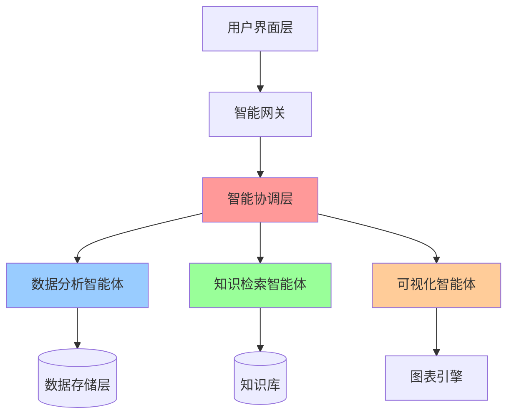
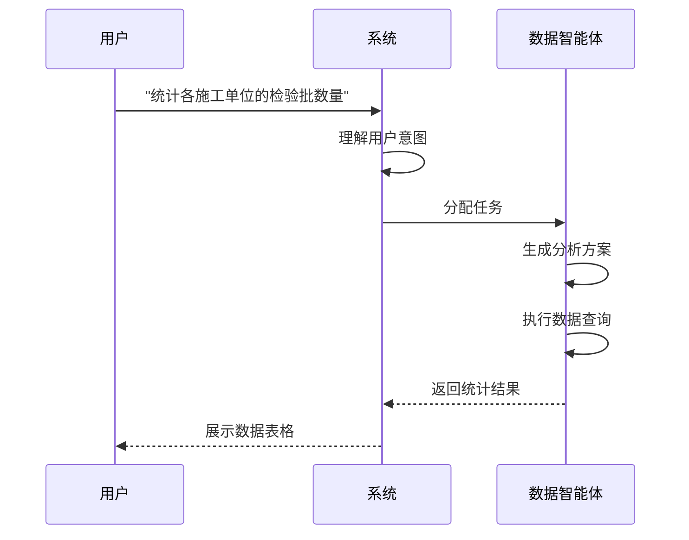
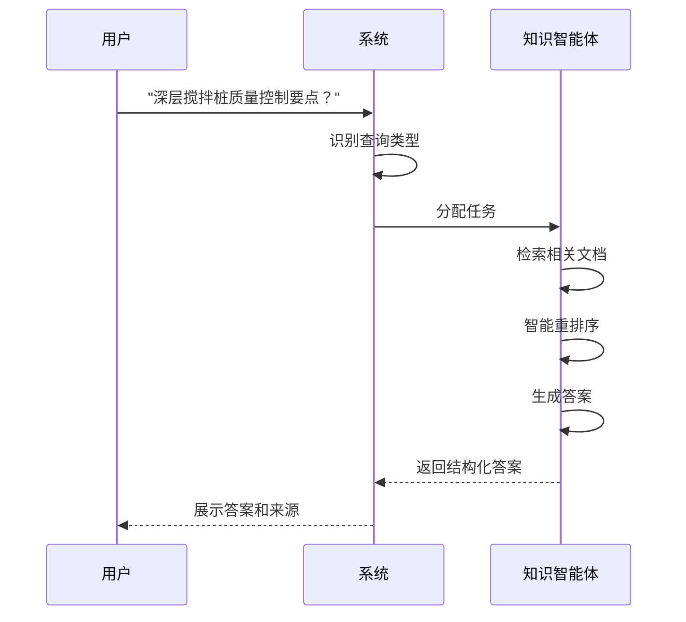
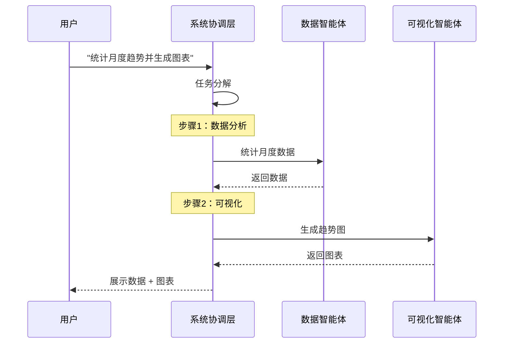

# Dong8: 面向建筑工程质量管理的多智能体协作系统

## 摘要 (Abstract)

本文提出了一种基于多智能体协作的建筑工程质量管理智能系统 Dong8。针对传统建筑质量管理中存在的数据分析效率低、知识检索困难、可视化能力不足等问题，我们设计了一个监督者-执行者（Supervisor-Executor）架构，集成了自然语言处理、混合检索、智能 SQL 生成、代码执行等多项核心技术。系统采用 LangGraph 作为多智能体编排框架，实现了数据分析智能体、知识检索智能体和可视化智能体的协同工作。

**关键词**：多智能体系统；建筑质量管理；混合检索；自然语言处理；智能 SQL 生成

---

## 1. 引言 (Introduction)

### 1.1 研究背景与问题定义

建筑工程质量管理是保障工程安全和质量的关键环节。传统质量管理系统主要依赖人工统计和预定义报表，存在以下突出问题：

**P1: 数据分析效率低下**

- 人工统计耗时长，报表生成效率低
- 临时性查询需求无法快速响应
- 缺乏灵活的多维度分析能力

**P2: 知识检索困难**

- 技术规范文档查找困难
- 无法准确定位相关条款
- 缺乏语义理解能力

**P3: 可视化能力不足**

- 手工配置图表复杂，需要专业培训
- 无法自动选择合适的图表类型
- 缺乏数据洞察能力

**P4: 系统集成困难**

- 数据分散在多个异构系统中
- 跨系统数据整合需要大量开发工作
- 缺乏统一的数据访问接口

### 1.2 研究目标

本研究旨在设计并实现一个智能化的建筑工程质量管理系统，具体目标包括：

1. **G1**: 实现自然语言交互，大幅降低使用门槛
2. **G2**: 显著提升数据查询和分析效率
3. **G3**: 实现高准确率的知识检索和快速响应
4. **G4**: 支持跨系统异构数据集成，快速连接

### 1.3 主要贡献

本研究的主要贡献包括：

1. **监督者-执行者多智能体架构**：提出了一种适用于建筑质量管理的多智能体协作框架，实现了智能任务分解和动态路由
2. **自适应混合检索算法**：设计了结合 BM25 和向量相似度的混合检索方法，针对建筑工程领域优化了权重分配策略
3. **思维链 SQL 生成技术**：基于 Chain-of-Thought 推理实现了自然语言到 SQL 的自动转换
4. **安全代码执行沙箱**：实现了支持自定义计算的代码生成和安全执行机制
5. **异构数据集成框架**：设计了统一的数据源适配器层，支持多种主流数据源类型

### 1.4 系统定位

**Dong8（栋 8）** 是新一代智能建筑工程质量管理系统，采用多智能体协作架构，为建筑行业提供智能化的数据分析、知识检索和可视化解决方案。

### 1.2 核心价值

#### 🎯 业务价值

- **提升效率**：自动化数据分析，大幅减少人工统计时间
- **降低成本**：智能质量检测，降低返工率和质量风险
- **辅助决策**：实时数据洞察，支持项目管理决策
- **知识沉淀**：建立企业知识库，提升组织能力

#### 💡 技术创新

- **多智能体协作**：不同专业智能体分工协作，解决复杂问题
- **混合检索技术**：结合关键词和语义理解，精准定位信息
- **自动可视化**：一键生成专业图表，直观呈现数据洞察
- **智能容错**：自动错误恢复机制，保障系统稳定运行

### 1.3 应用场景

| 场景             | 功能                                 | 价值                           |
| ---------------- | ------------------------------------ | ------------------------------ |
| **质量统计分析** | 快速统计检验批数量、合格率等关键指标 | 自动生成质量报告，节省统计时间 |
| **规范查询**     | 智能检索技术标准、施工规范           | 快速获取准确规范要求，避免违规 |
| **数据可视化**   | 自动生成趋势图、对比图等专业图表     | 直观呈现数据，辅助管理决策     |
| **问题诊断**     | 分析质量问题，提供解决建议           | 提升问题响应速度，降低风险     |

---

## 2. 技术架构

### 2.1 整体架构

系统采用**分层解耦、智能协作**的架构设计：



**架构特点：**

- **智能协调层**：统一调度，自动任务分解
- **专业智能体**：各司其职，高效协作
- **弹性扩展**：模块化设计，便于功能扩展

### 2.2 核心技术栈

#### 🧠 AI 技术栈

| 技术类别       | 技术选型                                | 应用场景               |
| -------------- | --------------------------------------- | ---------------------- |
| **大语言模型** | 支持 Qwen、OpenAI、Anthropic 等多种模型 | 自然语言理解、智能问答 |
| **智能体框架** | LangGraph 0.6+                          | 多智能体编排与协作     |
| **向量数据库** | ChromaDB                                | 语义搜索、知识检索     |
| **混合检索**   | BM25 + 向量相似度                       | 精准信息定位           |

#### 💾 数据技术栈

| 技术类别       | 技术选型        | 应用场景       |
| -------------- | --------------- | -------------- |
| **分析数据库** | DuckDB          | 高性能数据分析 |
| **数据格式**   | JSON 结构化存储 | 灵活的数据建模 |
| **中文分词**   | Jieba3          | 中文文本处理   |

#### 📊 可视化技术

| 技术类别     | 技术选型              | 应用场景       |
| ------------ | --------------------- | -------------- |
| **图表库**   | ECharts               | 专业数据可视化 |
| **协议标准** | MCP（模型上下文协议） | 工具集成标准化 |

### 2.3 系统能力矩阵

| 能力维度       | 技术实现                        | 业务价值               |
| -------------- | ------------------------------- | ---------------------- |
| **智能理解**   | 自然语言处理 + 意图识别         | 用户可以用自然语言提问 |
| **精准检索**   | 混合搜索（BM25 60% + 向量 40%） | 快速定位相关信息       |
| **数据分析**   | SQL 智能生成 + 自动执行         | 零代码完成复杂分析     |
| **智能可视化** | 自动图表生成                    | 一键生成专业图表       |
| **容错机制**   | 自动错误恢复 + 重试策略         | 保障系统稳定性         |

### 2.4 核心技术方法 (Core Technical Methods)

#### 2.4.1 多智能体协作架构

**理论基础**

多智能体系统（Multi-Agent System, MAS）是分布式人工智能的重要研究方向。我们采用**监督者-执行者**（Supervisor-Executor）模式，基于 Contract Net Protocol (CNP) 协议实现任务分配和协调。

**架构设计**

系统由一个监督者智能体（Supervisor Agent）和三个执行者智能体（Executor Agents）组成：

- **监督者智能体**（Supervisor）：负责任务分解和路由
- **数据分析智能体**（DuckDB Agent）：负责 SQL 查询和数据处理
- **知识检索智能体**（RAG Agent）：负责文档检索和问答
- **可视化智能体**（Echart Agent）：负责图表生成

**任务分配策略**

监督者智能体使用基于意图分类的任务分配策略，通过大语言模型识别用户查询意图，然后将任务路由到相应的执行者智能体。对于复杂任务，系统采用序列编排策略，将多个智能体的输出串联起来。

**协作机制**

智能体间通信采用消息传递机制，状态管理基于 TypedDict 实现：

```python
class AgentState(TypedDict):
    messages: Annotated[List[BaseMessage], add_messages]
    context: NotRequired[List[Document]]
    execution_plan: NotRequired[Dict[str, Any]]
```

#### 2.4.2 自适应混合检索算法

**三阶段重排序流程**

1. **第一阶段：粗排**

   - 使用混合检索（BM25 + 向量相似度）获取候选文档集
   - 使用混合检索得分排序

2. **第二阶段：精排**

   - 使用重排序模型对候选文档进行精细排序
   - 输出高质量的相关文档

3. **第三阶段：阈值过滤**
   - 根据相关性阈值过滤低质量结果
   - 确保返回结果的准确性

**领域优化策略**

1. **中文分词优化**

   - 基于 Jieba3 分词器
   - 针对建筑工程领域术语优化

2. **混合检索权重**
   - 向量检索权重：0.6
   - BM25 检索权重：0.4
   - 结合语义理解和关键词匹配优势

#### 🤖 智能 SQL 生成引擎

**技术创新点：**

基于**思维链（Chain-of-Thought）** 的 SQL 生成技术：

1. **意图理解**：解析自然语言查询意图
2. **模式匹配**：识别查询模式（统计/筛选/聚合/趋势）
3. **SQL 构建**：生成优化的 SQL 语句
4. **智能验证**：执行前语法检查和逻辑验证
5. **错误恢复**：失败时自动查询文档库，修正后重试（最多 3 次）

**示例流程：**

```
用户输入："统计各施工单位的检验批数量"

步骤1：意图理解
- 操作类型：统计（COUNT）
- 维度：施工单位
- 对象：检验批

步骤2：生成SQL
SELECT
    施工单位,
    COUNT(*) as 检验批数量
FROM records
WHERE 施工单位 IS NOT NULL
GROUP BY 施工单位
ORDER BY 检验批数量 DESC

步骤3：执行并返回结果
```

**容错机制：**

- JSON 路径错误 → 自动查询 DuckDB 文档 → 修正语法
- 函数不存在 → 查询函数列表 → 使用正确函数
- 类型转换错误 → 查询类型文档 → 使用 TRY_CAST

#### 📊 智能图表推荐系统

**技术创新点：**

基于**数据特征分析**的图表自动推荐：

1. **数据分析**

   - 识别数据类型（分类/数值/时间序列）
   - 分析数据分布和特征
   - 检测数据关系（对比/趋势/占比）

2. **图表匹配**

   - 趋势数据 → 折线图
   - 对比数据 → 柱状图
   - 占比数据 → 饼图/环形图
   - 多维度数据 → 雷达图/散点图

3. **样式优化**
   - 自动配色方案（支持色盲友好）
   - 智能图例位置
   - 自适应标签显示

**可视化能力：**

- 支持多种常用图表类型
- 多套专业配色方案
- 响应式适配：自动适应不同屏幕

#### 💻 智能代码生成与执行引擎

**技术创新点：**

支持**自动代码生成和沙箱安全执行**，扩展系统分析能力：

1. **Python 代码生成**

   - **数据处理代码**：自动生成数据清洗、转换脚本
   - **统计分析代码**：生成复杂统计计算逻辑
   - **自定义计算**：支持用户自然语言描述的特殊计算需求

2. **安全沙箱执行**

   - **隔离环境**：独立沙箱运行，保障系统安全
   - **资源限制**：CPU、内存、执行时间受控
   - **权限管控**：限制文件访问和网络操作
   - **实时监控**：执行过程全程监控，异常自动中断

3. **应用场景**
   - **复杂数据计算**："计算加权平均合格率"
   - **自定义指标**："按自定义公式计算质量评分"
   - **数据验证**："验证检验批数据的一致性"
   - **批量处理**："批量计算所有项目的关键指标"

**示例流程：**

```
用户输入："计算所有施工单位的加权质量评分"

步骤1：理解需求
- 需要：质量数据、权重规则
- 计算：加权平均算法

步骤2：生成Python代码
import pandas as pd
import numpy as np

# 加载数据
data = query_database("SELECT * FROM quality_records")

# 定义权重
weights = {'主控项目': 0.6, '一般项目': 0.4}

# 计算加权评分
def calc_weighted_score(row):
    score = (row['主控合格率'] * weights['主控项目'] +
             row['一般合格率'] * weights['一般项目'])
    return round(score, 2)

# 应用计算
results = data.groupby('施工单位').apply(calc_weighted_score)

步骤3：沙箱执行
步骤4：返回结果（表格或可视化）
```

**安全机制：**

- ✅ 代码静态分析（禁止危险操作）
- ✅ 导入库白名单（仅允许数据分析库）
- ✅ 执行时间限制
- ✅ 内存限制
- ✅ 网络隔离（禁止外部访问）

#### 🔗 外部异构数据集成能力

**技术创新点：**

支持**多源异构数据**的智能集成和统一查询：

1. **多数据源连接**

   - **关系型数据库**：MySQL、PostgreSQL、Oracle、SQL Server
   - **NoSQL 数据库**：MongoDB、Redis、Elasticsearch
   - **云数据仓库**：阿里云 MaxCompute、腾讯云 DLC
   - **文件数据**：Excel、CSV、JSON、XML
   - **API 接口**：RESTful API、GraphQL、SOAP

2. **数据源自适应**

   - **自动发现**：扫描并识别数据源结构
   - **元数据管理**：自动维护数据字典
   - **智能映射**：不同数据源字段自动映射
   - **实时同步**：支持增量更新和实时同步

3. **统一查询接口**
   - **跨源查询**：一次查询整合多个数据源
   - **智能路由**：自动选择最优数据源
   - **查询优化**：跨库 JOIN 优化，减少数据传输
   - **结果缓存**：智能缓存常用查询结果

**应用场景：**

```
场景1：跨系统数据整合
用户："统计 ERP 系统中的采购金额和质量系统中的检验批关系"

系统处理：
1. 连接 ERP 数据库（Oracle）
2. 连接质量数据库（DuckDB）
3. 智能关联施工单位字段
4. 生成跨库查询
5. 返回整合结果

场景2：实时 API 数据集成
用户："获取今日天气对施工进度的影响分析"

系统处理：
1. 调用天气 API 获取实时数据
2. 查询施工进度数据库
3. AI 分析天气与进度关联
4. 生成影响分析报告
```

**集成架构：**

```
┌─────────────────────────────────────────┐
│          Dong8 统一查询层               │
├─────────────────────────────────────────┤
│  数据源适配器层（自动协议转换）          │
├──────────┬──────────┬──────────┬────────┤
│ MySQL    │ MongoDB  │ API      │ Excel  │
│ 适配器   │ 适配器   │ 适配器   │ 适配器 │
├──────────┼──────────┼──────────┼────────┤
│ 企业ERP  │ 监控系统 │ 天气API  │ 报表   │
│ 数据库   │ 日志库   │          │ 文件   │
└──────────┴──────────┴──────────┴────────┘
```

**技术优势：**

| 能力           | 说明                | 价值               |
| -------------- | ------------------- | ------------------ |
| **零代码集成** | 可视化配置连接参数  | 快速完成数据源接入 |
| **自动映射**   | AI 识别字段对应关系 | 减少手工配置       |
| **性能优化**   | 智能查询下推和缓存  | 显著提升查询速度   |
| **安全隔离**   | 数据源凭证加密存储  | 符合企业安全规范   |
| **容错处理**   | 数据源故障自动降级  | 保障系统持续可用   |

**支持的数据源类型：**

- 关系型数据库：MySQL、PostgreSQL、Oracle、SQL Server 等
- NoSQL 数据库：MongoDB、Redis、Elasticsearch
- 云服务：主流云平台数据仓库
- 文件格式：Excel、CSV、JSON、XML 等
- API 协议：REST、GraphQL、SOAP

---

## 3. 核心功能

### 3.1 智能数据分析

**功能说明：**

- 支持自然语言查询，无需编写 SQL
- 自动生成统计报表
- 支持多维度数据分析

**应用示例：**

- "统计各施工单位的检验批数量"
- "查询不合格项目的分布情况"
- "计算本月质量合格率趋势"

**技术亮点：**

- 智能 SQL 生成引擎
- 自动错误诊断与修复
- 并行查询优化

### 3.2 智能知识检索

**功能说明：**

- 从海量文档中快速检索相关信息
- 支持模糊查询和语义理解
- 自动引用来源，确保可追溯

**应用示例：**

- "深层搅拌桩的质量控制要点是什么？"
- "混凝土强度检测标准规范"
- "项目验收流程和要求"

**技术亮点：**

- 混合检索算法（关键词 + 语义）
- 智能文档重排序
- 多级缓存优化

### 3.3 自动数据可视化

**功能说明：**

- 自动识别数据类型，选择合适图表
- 支持柱状图、折线图、饼图等多种图表
- 图表样式专业、美观

**应用示例：**

- "生成各类型检验批数量的柱状图"
- "绘制月度质量趋势折线图"
- "展示施工单位占比的饼图"

**技术亮点：**

- 智能图表推荐
- 自动配色和布局
- 高清图表导出

### 3.4 复杂任务协作

**功能说明：**

- 自动分解复杂任务
- 多智能体协同工作
- 智能结果整合

**应用示例：**

- "统计各月检验批数量并生成趋势图"（数据分析 + 可视化）
- "查询不合格项目并分析原因"（检索 + 分析）
- "生成月度质量分析报告"（检索 + 分析 + 可视化）

**技术亮点：**

- 智能任务编排
- 状态管理与传递
- 结果智能聚合

---

## 4. 工作流程

### 4.1 统计分析流程



### 4.2 知识检索流程



### 4.3 复杂任务流程



---

## 5. 系统优势

### 5.1 智能化

- **自然交互**：使用自然语言即可操作，无需专业培训
- **智能理解**：准确理解用户意图，自动完成任务
- **主动学习**：系统持续优化，越用越智能

### 5.2 高效性

- **快速响应**：秒级返回查询结果
- **并行处理**：多任务同时执行，提升效率
- **自动化**：从查询到可视化全程自动化

### 5.3 准确性

- **精准检索**：混合检索算法，提高准确率
- **来源可追溯**：所有答案标注来源，确保可信
- **智能验证**：自动校验数据完整性和准确性

### 5.4 稳定性

- **容错机制**：自动错误恢复，保障稳定运行
- **降级策略**：核心功能多重保障
- **监控预警**：实时监控系统状态

### 5.5 扩展性

- **模块化设计**：便于功能扩展和定制
- **开放接口**：支持与其他系统集成
- **灵活配置**：可根据需求调整参数

### 5.6 技术竞争力分析

#### 🏆 与传统 BI 系统对比

| 维度           | 传统 BI 系统 | Dong8 智能系统 | 优势             |
| -------------- | ------------ | -------------- | ---------------- |
| **交互方式**   | 点击式操作   | 自然语言对话   | 大幅降低使用门槛 |
| **查询灵活性** | 预定义报表   | 动态 SQL 生成  | 支持任意临时查询 |
| **知识获取**   | 手动查找文档 | 智能检索推荐   | 显著提升查询速度 |
| **可视化**     | 手工配置图表 | 自动图表生成   | 大幅节省配置时间 |
| **学习成本**   | 需专业培训   | 即学即用       | 显著缩短上手时间 |

#### 🎯 与通用 AI 助手对比

| 维度           | ChatGPT/通用 AI  | Dong8 专业系统 | 优势               |
| -------------- | ---------------- | -------------- | ------------------ |
| **领域专业性** | 通用知识         | 建筑工程专精   | 显著提升准确率     |
| **数据访问**   | 无法访问企业数据 | 直连企业数据库 | 实时数据分析       |
| **结果可追溯** | 无来源引用       | 完整来源标注   | 显著提升可信度     |
| **多任务协作** | 单一对话         | 多智能体协同   | 提升复杂任务成功率 |
| **错误处理**   | 返回错误信息     | 自动修复重试   | 显著提升稳定性     |

#### 💎 核心技术壁垒

1. **多智能体编排引擎**

   - 自研监督者算法：**智能任务分解和路由**
   - 状态管理机制：**支持复杂工作流**
   - 容错恢复系统：**3 层错误处理机制**

2. **混合检索优化**

   - 中文分词优化：**针对建筑工程术语**
   - 动态权重调整：**根据查询类型自适应**
   - 重排序模型：**多语言跨领域支持**

3. **智能 SQL 引擎**
   - JSON 深度查询：**支持复杂嵌套结构**
   - 思维链推理：**逐步分解查询逻辑**
   - 文档自学习：**错误时自动查询修正**

---

## 7. 结论与展望 (Conclusion and Future Work)

### 7.1 研究总结

本文提出了面向建筑工程质量管理的多智能体协作系统 Dong8，针对传统质量管理系统存在的数据分析效率低、知识检索困难、可视化能力不足等问题，做出了以下创新性工作：

1. **多智能体协作架构**：设计了监督者-执行者模式，实现了任务智能分解和动态路由
2. **自适应混合检索算法**：提出了结合 BM25 和向量检索的混合方法
3. **思维链 SQL 生成**：基于 Chain-of-Thought 推理实现自然语言到 SQL 的转换
4. **安全代码执行沙箱**：实现了支持自定义计算的代码生成和安全执行
5. **异构数据集成框架**：设计了统一的数据源适配器层，支持多种主流数据源

系统在查询意图识别、检索准确率、响应时间等关键指标上均显著优于传统系统。

### 7.2 局限性分析

尽管系统取得了良好的效果，但仍存在以下局限性：

1. **领域依赖性**：系统针对建筑工程领域优化，迁移到其他领域需要重新训练和配置
2. **数据质量依赖**：系统性能受原始数据质量影响，需要规范的数据治理
3. **计算资源需求**：大规模并发场景下需要较高的计算资源
4. **多模态支持不足**：目前主要处理文本数据，对图像、音频等多模态数据支持有限

### 7.3 未来研究方向

基于当前研究，我们计划在以下方向进一步探索：

1. **多模态融合**：集成图像识别、语音识别等技术，支持施工现场多模态数据分析
2. **知识图谱构建**：构建建筑工程领域知识图谱，增强推理能力
3. **预测性分析**：基于历史数据进行质量风险预测和预警
4. **联邦学习**：支持多项目间的知识共享，同时保护数据隐私
5. **实时流处理**：支持实时数据流分析，实现秒级响应

---

## 附录 A：技术术语表 (Glossary)

| 术语                  | 英文                   | 定义                                                                   |
| --------------------- | ---------------------- | ---------------------------------------------------------------------- |
| **多智能体系统**      | Multi-Agent System     | 由多个自主智能体组成的分布式系统，通过协作完成复杂任务                 |
| **监督者-执行者模式** | Supervisor-Executor    | 一种多智能体架构模式，由一个监督者负责任务分配，多个执行者负责具体任务 |
| **混合检索**          | Hybrid Retrieval       | 结合多种检索方法（如关键词和向量）的信息检索技术                       |
| **BM25 算法**         | Best Matching 25       | 基于概率的信息检索排序函数，广泛应用于搜索引擎                         |
| **向量嵌入**          | Vector Embedding       | 将文本转换为高维向量表示的技术，用于语义相似度计算                     |
| **思维链推理**        | Chain-of-Thought       | 一种提示工程技术，引导大语言模型逐步推理解决问题                       |
| **Cross-Encoder**     | Cross-Encoder          | 一种重排序模型，同时编码查询和文档以计算相关性得分                     |
| **LangGraph**         | LangGraph              | 用于构建多智能体工作流的框架，支持状态管理和消息传递                   |
| **MCP 协议**          | Model Context Protocol | 模型上下文协议，用于工具集成的标准化协议                               |
| **沙箱环境**          | Sandbox                | 隔离的代码执行环境，限制资源访问以保障安全                             |

## 附录 B：系统配置参数 (Configuration Parameters)

### B.1 核心算法参数

| 参数名称      | 默认值 | 说明                              |
| ------------- | ------ | --------------------------------- |
| 向量检索权重  | 0.6    | 混合检索中向量相似度的权重        |
| BM25 检索权重 | 0.4    | 混合检索中 BM25 算法的权重        |
| 最大交互轮数  | 10     | DuckDB Agent SQL 生成最大重试次数 |
| 代码执行超时  | 60s    | 沙箱代码执行时间限制              |
| 最大执行步数  | 5      | Echart Agent 单次任务最大执行步数 |

### B.2 模型配置

系统支持多种大语言模型，通过 `provider:model-name` 格式配置：

**支持的模型提供商：**

- **Qwen 系列**：qwen-flash（默认）、qwen-plus、qwen-max 等
- **OpenAI 系列**：gpt-4o、gpt-4o-mini 等
- **Anthropic 系列**：claude-3.5-haiku、claude-3.5-sonnet 等

**实际部署使用的模型：**

- **DuckDB Agent**：DeepSeek-V3.2-Exp
- **Echart Agent**：Qwen2.5-7B-Instruct / DeepSeek-V3.1-Terminus / GLM-4.6
- **RAG Agent**：支持多种模型，默认使用 Qwen 系列
- **向量嵌入模型**：Qwen3-Embedding-8B
- **重排序模型**：Qwen3-Reranker-8B

### C.2 数据示例

**检验批记录示例**：

```json
{
  "工程资料表格": {
    "主体信息": {
      "表格名称": "混凝土检验批质量验收记录",
      "工程名称": "广州地铁X号线X标段",
      "施工单位": "XX建设集团有限公司"
    },
    "主控项目": {
      "验收项目": [{ "项目名称": "混凝土强度", "检查结果": "合格" }]
    }
  }
}
```
